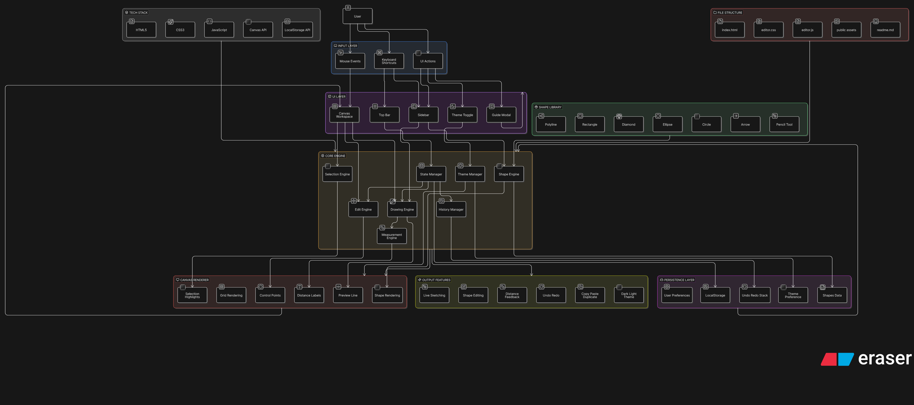

# Polyline Editor Pro

A modern browser-based polyline and shape editor built with HTML, CSS, JavaScript, and the Canvas API.

It is designed for fast sketching, clean shape placement, live distance feedback, and smooth editing in both dark and light themes.

## Preview




## Highlights

- Draw polylines with a live dotted preview line.
- Show distance labels between points and along shape edges.
- Add ready-made shapes like rectangle, diamond, ellipse, circle, and arrow.
- Draw freehand polylines with the pencil tool.
- Move shapes and points directly on the canvas.
- Drag empty grid space to pan the canvas view.
- Pan the view with arrow keys when no shape is selected.
- Preview the previous state of a shape with press, hold, and release.
- Delete individual points, full shapes, or selected content.
- Zoom smoothly with the mouse wheel while keeping the view stable.
- Switch between dark and light themes.
- Use keyboard shortcuts for faster editing.
- Open an in-app guide for feature help.

## Core Features

### 1. Smart Drawing

- Click to place polyline points.
- See a dotted preview from the last point to the cursor.
- View live segment distance while drawing.
- Finish or cancel quickly with keyboard shortcuts.

### 2. Shape Library

- Rectangle
- Diamond
- Ellipse
- Circle
- Arrow
- Freehand Pencil

Each shape can be added from the sidebar and styled with custom stroke color, size, and line width.

### 3. Editing Workflow

- Select a shape by clicking on it.
- Drag a full shape in Move mode.
- Drag individual points to refine geometry.
- Press and hold a shape to preview its previous saved state.
- Release the mouse to return to the current state.

### 4. Visual Measurement

- Segment lengths are shown directly on the canvas.
- Shapes display edge lengths for better visual feedback.
- Polyline drawing shows live cursor-to-point measurement.

### 5. Theme Support

- Dark theme for focused work.
- Light theme for clean presentation.
- Theme toggle in the top-right corner.

## Interface Overview

### Sidebar

- Shape library (pinned at the top)
- Stroke color picker
- Snap and grid controls
- Shape controls
- Mode controls

### Canvas

- Grid-based drawing area
- Keyboard shortcut hint panel
- Selection action bar
- Live drawing and measurement feedback

### Top Bar

- App branding
- Menu actions
- Guide button
- Theme toggle

## Keyboard Shortcuts

| Shortcut | Action |
| --- | --- |
| `B` | Draw mode |
| `M` | Move mode |
| `D` | Delete mode |
| `Esc` | Return to idle |
| `Ctrl+Z` | Undo |
| `Ctrl+Y` | Redo |
| `Ctrl+C` | Copy |
| `Ctrl+V` | Paste |
| `Ctrl+X` | Cut |
| `Ctrl+D` | Duplicate |
| `Delete` | Delete selection |
| `Arrow Keys` | Nudge selected shape, or pan view when nothing is selected |
| `Shift + Arrow Keys` | Larger step nudge/pan |
| `Mouse Wheel` | Zoom in/out (stable centered zoom) |
| `Drag Empty Grid` | Pan view with mouse |

## Project Structure

```text
HCI-Project/
├── index.html
├── css/
│   └── editor.css
├── js/
│   └── editor.js
├── public/
│   ├── Screenshot 2026-04-01 182000.png
│   ├── Screenshot 2026-04-01 182123.png
│   ├── Screenshot 2026-04-01 182138.png
│   └── Screenshot 2026-04-01 182309.png
└── readme.md
```

## Getting Started

1. Open the project folder.
2. Launch `index.html` in your browser.
3. Choose a mode from the sidebar.
4. Draw shapes or polylines on the canvas.
5. Use the Guide button to review all features.

## Technology

- HTML5
- CSS3
- Vanilla JavaScript
- Canvas 2D API
- LocalStorage for persistence

## Use Cases

- HCI or graphics coursework
- Diagram experimentation
- Shape editing demos
- Canvas interaction prototypes
- Polyline manipulation practice

## Notes

- The editor runs directly in the browser.
- No external build step is required.
- The interface is optimized for quick visual interaction.

## Authoring Goal

This project focuses on making canvas editing feel visual, direct, and interactive, while keeping the codebase lightweight and easy to understand.
